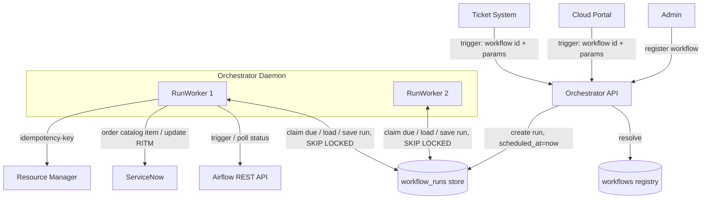

*[← Index](README.md)*

# Architecture Overview

**Workflow registry.** A `workflow` table is registered ahead of time (admin API) and maps a stable **`identifier`** → `run_type` (automation | resource), `engine_type`, `automation_id` (Airflow: DAG id), and `ticket_template_id` (provider-agnostic; ServiceNow: the catalog item to order). An external service (Cloud Portal, Ticket System) triggers a run by naming the workflow `identifier` and supplying three parameter sets — **ticket_params** (RITM variables), **workflow_params** (engine conf), and **resource** (a typed `ResourceSpec`, resource flow only). The orchestrator resolves the registration to decide the run type and how to build it. Both flows **create** the RITM by ordering the mapped catalog item.

Two asynchronous workflow types (both create the RITM):
1. **Automation Flow**: trigger → resolve workflow → create RITM → run workflow engine → close RITM.
2. **Resource Flow**: trigger → resolve workflow → create RITM → Resource Manager (reserve/create) → run workflow engine → finalize resource → close RITM.

**Run state, one durable store.** The durable object is a **`WorkflowRun`** row (type, status, `current_step`, per-step `state`, `scheduled_at`, `version`) that *we* own. It holds no queue mechanics (no `locked_by`, no `lock_expires_at`); the one time-related field, `scheduled_at`, is application scheduling — "(re-)drive me at/after this time" — not a lease. A run is advanced by a worker claiming its row and driving it: load, step forward, persist, and (if the run must wait or retry) set `scheduled_at` to a future time.

**No separate queue, no scheduler.** There is no transport interface, no broker, no message, and no producer/consumer split. The `workflow_runs` table ordered by `scheduled_at` with `FOR UPDATE SKIP LOCKED` **is** the durable, single-delivery work queue, and the workers read it directly. A dedicated queue (pgqueuer, RabbitMQ) — or even an in-process scheduler feeding a worker pool — was considered and cut: because reliability is app-owned — `claim_due` + a re-drive lease + optimistic `version` + idempotency keys — either would only restate the workers' own claim with a second mechanism over the same database. Deferral (poll, backoff) is `WorkflowRun.scheduled_at`; delivery is a worker's own `claim_due`.

**Coordination model.**
- **Workers claim their own work.** The daemon runs a pool of identical `RunWorker` loops (`worker_concurrency_limit` of them). Each claims **one** due run (`scheduled_at <= now`, `FOR UPDATE SKIP LOCKED`), drives it through `RunExecutor.handle`, and claims again. Capacity is just the loop count; a worker only claims when it's free, so a claimed run is always being actively worked.
- **Application owns retry *policy*.** The `WorkflowRun` tracks per-step attempt counts in `state.step_attempts`. On a transient failure the executor increments the count and, if under `max_retries`, sets `scheduled_at = now + backoff`; once exhausted the run terminates `FAILED` and escalates.
- **Crash recovery is a re-drive lease.** `claim_due` pushes each claimed run's `scheduled_at` forward by a lease before driving, so a run whose worker dies becomes due again and is re-driven by another worker. Idempotency keys make the re-drive safe.
- **Optimistic concurrency** on `WorkflowRun`: every save checks the expected `version`, bumps it, and raises `StaleRunError` on conflict (the concurrent writer is an overlapping re-drive after a lease expiry — rare but possible). The executor drops the lost save; another worker re-drives — it never clobbers.
- **Completion is polled; callbacks only wake early.** An in-progress step sets `scheduled_at` a poll interval ahead. A callback route lets an external system make the run due *now* (`runs.wake(...)`) to shorten that wait — it does not write run state or advance the run itself, so the poll stays the single authoritative wake-up-and-decide mechanism.
- Exactly-once external side effects come from **server-side idempotency keys** `(run_id, step, attempt)`, independent of any transport.
- **No Saga.** Permanent step failure ends the run at `FAILED`; nothing is undone.

**Workflow engines.** `WorkflowEngineClient` is an interface; concrete engines live in a plain `Mapping[WorkflowEngineType, WorkflowEngineClient]` built in bootstrap. `RunEngineStep` reads the run's `state.workflow.engine_type` + `automation_id` and dispatches to the right client. **Airflow** is the first engine.

