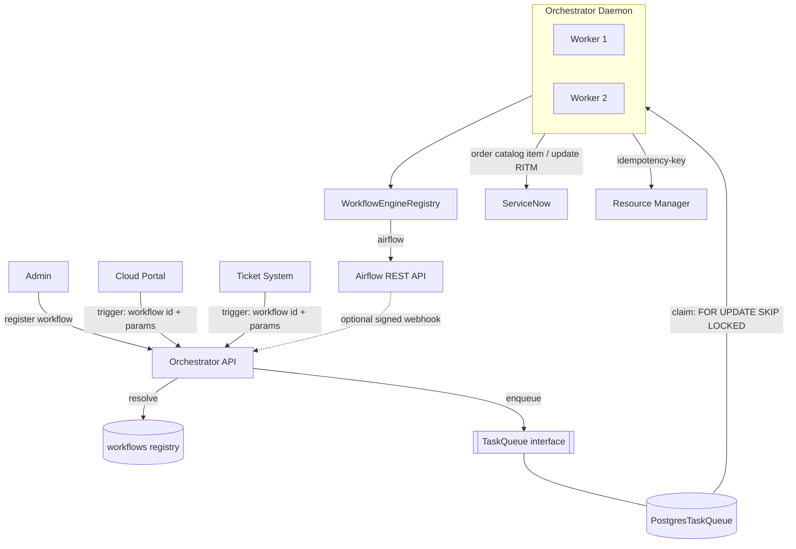

# Orchestrator Core Component Design and Implementation Plan

Architecture, persistence, queue mechanics, saga state machine, and Python interfaces for the orchestrator core of our private cloud system.

> [!NOTE]
> **This revision** adopts: **SQLModel** for the persistence schema, **Pydantic v2** for the API/domain models, **pydantic-settings** for configuration, a **`TaskQueue` interface** with a database-backed implementation, and a **pluggable workflow-engine layer** with **Airflow as the first engine** and **ServiceNow** as the ticket system. A **`workflow` registry** maps a stable workflow identifier → (task type, engine type, engine automation id, provider ticket-template id). External services trigger a task by naming a registered workflow plus the parameter sets; the orchestrator resolves the registration to build the task. All prior correctness safeguards are retained — see [Design safeguards](#design-safeguards).

## User Review Required

> [!IMPORTANT]
> **Contracts on external services:**
> 1. **Idempotency keys.** The queue is at-least-once (a worker can crash mid-call, or a lease can expire during a slow call). Every side-effecting external call carries a per-attempt idempotency key `(task_id, step, attempt)`. **Airflow** sends it as the `dag_run_id` (a duplicate returns HTTP 409, treated as "already triggered"). **ServiceNow** Create Request has no native idempotency key, so the orchestrator looks up an RITM tagged with `correlation_id == key` before ordering and tags the new RITM after (residual window: a crash between ordering and tagging could double-order within one attempt; the reverse-walk `compensate()` + per-attempt key bound it). **Project Manager** Create Resource is effectively keyed by the caller-supplied `vendor_id` (plus an orchestrator-added `Idempotency-Key` header). *Confirm each service actually honors these.*
> 2. **Completion signal.** **Airflow is polling-first** (`query_run_status`; no native outbound webhook). A signed webhook (`X-Signature` HMAC) is supported for engines that can call back, but correctness does not depend on it.
> 3. **Failure model.** On a step's permanent failure the orchestrator opens a ServiceNow **Incident** to the responsible group (from Airflow *Get Task Exceptions* for DAG failures, else the default `cloudio` team) and adds a work note to the corresponding RITM. Transient errors are retried first (backoff); the Incident opens once retries are exhausted. *If you want DAG failures to skip retries and escalate immediately, set the automation workflow's `max_retries=0`.*

---

## Architecture Overview

**Workflow registry.** A `workflow` table is registered ahead of time (admin API) and maps a stable **`identifier`** → `task_type` (automation | resource), `engine_type`, `automation_id` (Airflow: DAG id), and `ticket_template_id` (provider-agnostic; ServiceNow: the catalog item to order). An external service (Cloud Portal, Ticket System) triggers a task by naming the workflow `identifier` and supplying three parameter sets — **ticket_params** (RITM variables), **workflow_params** (engine conf), and **resource_params** (resource spec, resource flow only). The orchestrator resolves the registration to decide the task type and how to build it. Both flows **create** the RITM by ordering the mapped catalog item.

Two asynchronous workflow types (both create the RITM):
1. **Automation Flow**: trigger → resolve workflow → create RITM → run workflow engine → resolve RITM.
2. **Resource Flow**: trigger → resolve workflow → create RITM → Resource Manager (reserve/create) → run workflow engine → finalize RITM & resource.

**Queue.** The orchestrator depends on a `TaskQueue` **interface**, not on a database. The first implementation, `PostgresTaskQueue`, uses PostgreSQL as the queue (`SELECT ... FOR UPDATE SKIP LOCKED`, earliest-deadline-first). Swapping in another backend (e.g. a broker) later means implementing the same interface.

**Coordination model.**
- `next_run_at` is scheduling + lease + crash-recovery clock; workers never hold a DB row lock across an external call.
- A `version` column gives optimistic concurrency: every write re-selects `FOR UPDATE`, checks the expected version, bumps it, and raises `StaleTaskError` on conflict rather than clobbering.
- Exactly-once external side effects come from **server-side idempotency keys** `(task_id, step, attempt)`, not the lease.
- **Saga**: on permanent step failure the task enters `REVERTING` and completed steps are undone in reverse via each handler's `compensate()`.

**Workflow engines.** `WorkflowEngineClient` is an interface; concrete engines register in a `WorkflowEngineRegistry` keyed by `WorkflowEngineType`. `TriggerWorkflowStep` reads the task's `workflow_engine_type` + `workflow_automation_id` and dispatches to the right client. **Airflow** is the first engine.



---

## Code Architecture & Directory Structure

The code is organized as a **Clean Architecture / DDD hexagonal** layout under a `src/` layout, with
four concentric layers and a strict inward-only dependency rule. Every substantial class lives in its
own file; trivial enums, exceptions, and paired request/response DTOs are grouped by role.

| Layer (dir) | Holds | Depends on |
|---|---|---|
| **`core/`** — domain + ports | entities/value objects/enums (`domain/`) and the abstract **ports** every outer layer implements or consumes (`ports/`). Pure — no framework, no I/O. | nothing |
| **`application/`** — services / use-cases | the orchestration engine (executor, step handlers, strategies, compensation), the engine registry, and the task/workflow application services. Talks only to **ports**. | `core` |
| **`infrastructure/`** — adapters | concrete implementations of the ports: Postgres queue & repository, ServiceNow / Project Manager / Airflow clients, DB session, settings. | `core` |
| **`entrypoints/`** — apps / delivery | the FastAPI app (routers + HTTP schemas), the worker daemon, and `bootstrap` (the composition root that wires infrastructure adapters into the ports). | `core`, `application`, `infrastructure` |

**Dependency rule:** arrows point inward only. `application` and `infrastructure` both depend on
`core` (the ports) but never on each other; `entrypoints/bootstrap` is the *only* place concrete
adapters are bound to ports. This is exactly the plan's ports-and-adapters design (`TaskQueue`,
`TicketSystemClient`, `ResourceManagerClient`, `WorkflowEngineClient` are the ports) made explicit
in the tree.

### Directory tree

```text
cloudio-orchestrator/
├── pyproject.toml
├── alembic.ini                             # script_location → src/orchestrator/infrastructure/database/migrations
├── .env.example
├── README.md
├── implementation_plan.md
├── tests/
│   ├── conftest.py
│   ├── test_queue_conformance.py           # shared TaskQueue port conformance suite
│   ├── test_clients_airflow.py
│   ├── test_clients_servicenow.py
│   ├── test_clients_project_manager.py
│   ├── test_orchestration.py
│   └── test_api.py
└── src/
    └── orchestrator/
        ├── __init__.py
        │
        ├── core/                           # ── DOMAIN + PORTS (pure; depends on nothing) ──
        │   ├── __init__.py
        │   ├── domain/
        │   │   ├── __init__.py
        │   │   ├── enums.py                 # TaskType, TaskStatus, WorkflowEngineType (plain Enum)
        │   │   ├── time.py                  # utcnow()
        │   │   ├── exceptions.py            # StaleTaskError, StepDeadlineExceeded
        │   │   ├── value_objects.py         # TicketRef
        │   │   └── models/                  # PURE domain entities (Pydantic; no ORM/SQL) — one per file
        │   │       ├── __init__.py
        │   │       ├── task.py              # Task           (plain dict metadata; no sqlalchemy)
        │   │       └── workflow.py          # Workflow
        │   └── ports/                       # abstract interfaces (implemented in infrastructure)
        │       ├── __init__.py
        │       ├── task_queue.py            # TaskQueue (ABC), CLAIMABLE
        │       ├── workflow_repository.py   # WorkflowRepository (ABC)
        │       ├── ticket_system.py         # TicketSystemClient (ABC)
        │       ├── resource_manager.py      # ResourceManagerClient (ABC)
        │       └── workflow_engine.py       # WorkflowEngineClient (ABC)
        │
        ├── application/                     # ── SERVICES / USE-CASES (depends on core only) ──
        │   ├── __init__.py
        │   ├── engine_registry.py           # WorkflowEngineRegistry (holds WorkflowEngineClient ports)
        │   ├── services/
        │   │   ├── __init__.py
        │   │   ├── task_service.py          # TaskService — trigger/get/list use cases
        │   │   └── workflow_service.py      # WorkflowService — register/get/list use cases
        │   └── orchestration/
        │       ├── __init__.py
        │       ├── keys.py                  # _idem_key(), _ticket_ref() helpers
        │       ├── escalator.py             # FailureEscalator
        │       ├── executor.py              # TaskStrategyExecutor
        │       ├── handlers/
        │       │   ├── __init__.py
        │       │   ├── base.py              # TaskStepHandler (ABC)
        │       │   ├── create_ticket.py     # CreateTicketStep
        │       │   ├── update_ticket.py     # UpdateTicketStep
        │       │   ├── trigger_workflow.py  # TriggerWorkflowStep
        │       │   ├── create_resource.py   # CreateResourceStep
        │       │   └── finalize_resource.py # FinalizeResourceStatusStep
        │       └── strategies/
        │           ├── __init__.py
        │           ├── base.py              # TaskStrategy (ABC)
        │           ├── automation.py        # AutomationTaskStrategy
        │           ├── resource.py          # ResourceTaskStrategy
        │           └── factory.py           # build_strategies()
        │
        ├── infrastructure/                  # ── ADAPTERS (implement core ports; depend on core) ──
        │   ├── __init__.py
        │   ├── config.py                    # Settings (pydantic-settings)
        │   ├── database/                   # all persistence lives here
        │   │   ├── __init__.py
        │   │   ├── session.py               # make_session_factory (async engine + sessionmaker)
        │   │   ├── migrations/              # Alembic (alembic.ini at repo root points its script_location here)
        │   │   │   ├── env.py
        │   │   │   └── versions/
        │   │   │       └── 0001_initial.py  # native enums + tables + partial indexes (DDL from the plan)
        │   │   └── postgres/                # PostgreSQL adapter (native enums, JSONB, SELECT … SKIP LOCKED)
        │   │       ├── __init__.py
        │   │       ├── enums.py             # _enum_values + native-PG-enum column helpers
        │   │       ├── task_table.py        # TaskTable (SQLModel table=True) + Task⇄row mapping
        │   │       ├── workflow_table.py    # WorkflowTable (SQLModel table=True) + Workflow⇄row mapping
        │   │       ├── task_queue.py        # PostgresTaskQueue          → implements TaskQueue (maps at boundary)
        │   │       └── workflow_repository.py  # PostgresWorkflowRepository → implements WorkflowRepository
        │   ├── ticket/
        │   │   ├── __init__.py
        │   │   └── servicenow.py            # ServiceNowTicketClient → implements TicketSystemClient
        │   ├── resource/
        │   │   ├── __init__.py
        │   │   └── project_manager.py       # ProjectManagerResourceClient → implements ResourceManagerClient
        │   └── engine/
        │       ├── __init__.py
        │       └── airflow.py               # AirflowWorkflowEngineClient → implements WorkflowEngineClient
        │
        └── entrypoints/                     # ── APPS / DELIVERY (wires everything) ──
            ├── __init__.py
            ├── bootstrap.py                 # build() — composition root (binds adapters → ports)
            ├── api/
            │   ├── __init__.py
            │   ├── app.py                   # FastAPI() app; mounts routers
            │   ├── dependencies.py          # get_settings, get_task_service, get_workflow_service, ...
            │   ├── schemas/                 # HTTP request/response DTOs (delivery contracts)
            │   │   ├── __init__.py
            │   │   ├── workflow.py          # WorkflowRegisterRequest, WorkflowResponse
            │   │   └── task.py              # TaskTriggerRequest, TaskResponse
            │   └── routers/
            │       ├── __init__.py
            │       ├── workflows.py         # register_workflow, get_workflow
            │       ├── tasks.py             # trigger_task, get_task, list_tasks
            │       └── callbacks.py         # task_step_callback
            └── worker/
                ├── __init__.py
                └── worker.py                # OrchestratorWorker, generate_worker_id()
```

### File → class mapping

Each flat module in [Proposed Changes](#proposed-changes) maps onto the layers as follows:

| Flat module (Proposed Changes) | Layer → files |
|---|---|
| `config.py` | **infra** → `infrastructure/config.py` (`Settings`) |
| `models.py` | **core** → `core/domain/enums.py` (`TaskType`, `TaskStatus`, `WorkflowEngineType`) · `core/domain/time.py` (`utcnow`) · `core/domain/models/{task,workflow}.py` (pure `Task`, `Workflow` entities) · **infra** → `infrastructure/database/postgres/{task_table,workflow_table}.py` (`TaskTable`, `WorkflowTable` + mappers), `infrastructure/database/postgres/enums.py` (`_enum_values`, native-enum helpers) |
| `schemas.py` | **core** → `core/domain/value_objects.py` (`TicketRef`) · **entrypoints** → `entrypoints/api/schemas/{workflow,task}.py` (the HTTP request/response DTOs) |
| `queue.py` | **core** → `core/domain/exceptions.py` (`StaleTaskError`), `core/ports/task_queue.py` (`TaskQueue`, `CLAIMABLE`; typed in terms of the **domain** `Task`) · **infra** → `infrastructure/database/postgres/task_queue.py` (`PostgresTaskQueue`; reads/writes `TaskTable`, maps to `Task` at the boundary), `infrastructure/database/session.py` (`make_session_factory`) |
| `workflows.py` | **core** → `core/ports/workflow_repository.py` (`WorkflowRepository` ABC) · **infra** → `infrastructure/database/postgres/workflow_repository.py` (`PostgresWorkflowRepository` impl) |
| `clients.py` | **core** → `core/ports/{ticket_system,resource_manager,workflow_engine}.py` (the three ABCs) · **application** → `application/engine_registry.py` (`WorkflowEngineRegistry`) · **infra** → `infrastructure/ticket/servicenow.py`, `infrastructure/resource/project_manager.py`, `infrastructure/engine/airflow.py` |
| `strategies.py` | **core** → `core/domain/exceptions.py` (`StepDeadlineExceeded`) · **application** → `application/orchestration/keys.py`, `application/orchestration/escalator.py` (`FailureEscalator`), `application/orchestration/executor.py` (`TaskStrategyExecutor`), `application/orchestration/handlers/*` (one file per `*Step` + `base.py` for `TaskStepHandler`), `application/orchestration/strategies/*` (`base`, `automation`, `resource`, `factory`) |
| `worker.py` | **entrypoints** → `entrypoints/worker/worker.py` (`OrchestratorWorker`, `generate_worker_id`) |
| `api.py` | **entrypoints** → `entrypoints/api/app.py`, `dependencies.py`, `routers/{workflows,tasks,callbacks}.py` (thin routers delegating to the application services) |
| `bootstrap.py` | **entrypoints** → `entrypoints/bootstrap.py` (`build`) |

### Notes on the DDD refactor

- **Ports live in `core`, adapters in `infrastructure`.** The plan's interfaces (`TaskQueue`,
  `TicketSystemClient`, `ResourceManagerClient`, `WorkflowEngineClient`, plus a formalized
  `WorkflowRepository` ABC) become `core/ports/*`; their concrete classes move to
  `infrastructure/*`. `application` imports only the ports, so it never sees ServiceNow/Airflow/SQL.
- **New application services** (`TaskService`, `WorkflowService`) hold the orchestration currently
  written inline in the `api.py` route bodies (resolve workflow → validate → build metadata →
  enqueue). Routers shrink to HTTP concerns and delegate; this keeps use-cases out of the delivery
  layer. `WorkflowEngineRegistry` also moves to `application` since it references only the port.
- **`WorkflowRepository` gains an ABC** for symmetry with `TaskQueue`: the port in `core`, the
  `PostgresWorkflowRepository` implementation in `infrastructure/database/postgres/`.
- **Domain models are decoupled from persistence.** `Task`/`Workflow` in `core/domain/models` are
  **pure Pydantic entities** with no `sqlalchemy` import — the application layer mutates them freely
  (status, `version`, a plain `metadata` dict). The ORM lives in `infrastructure/database/postgres`
  as `TaskTable`/`WorkflowTable` (SQLModel `table=True`), which own every persistence detail — native
  PG enums, the `_enum_values` helper, `MutableDict`/JSONB, indexes. Each table file also holds its
  **mapper** (`row → entity` / `apply(entity → row)`); the `TaskQueue` and `WorkflowRepository` ports
  are declared in terms of the domain entities, and the Postgres adapters translate at the boundary.
  This is why the ORM classes can't simply be "moved" to infra: since the application depends on
  `Task`, the entity must stay in `core` while only its table representation lives in infra.
  Bonus: `MutableDict` (a SQLAlchemy change-tracking shim) no longer leaks into the domain — the
  adapter writes the whole `metadata` dict back on `commit()`, so nothing depends on in-place tracking.
- **Imports** are absolute and layer-qualified, e.g.
  `from orchestrator.core.ports.ticket_system import TicketSystemClient`,
  `from orchestrator.infrastructure.engine.airflow import AirflowWorkflowEngineClient`. Each package's
  `__init__.py` re-exports its public symbols. No module is named `queue`, so the stdlib-`queue`
  shadow in the original flat plan disappears.

---

## Proposed Changes

> [!NOTE]
> The code blocks below are grouped by original flat module for readability. On disk each class ships in the **Clean Architecture / DDD layer** (`core` / `application` / `infrastructure` / `entrypoints`) shown in [Code Architecture & Directory Structure](#code-architecture--directory-structure) above — see the [file→class mapping](#file--class-mapping) for where each class lands.

### config.py — pydantic-settings

```python
from pydantic import SecretStr, Field
from pydantic_settings import BaseSettings, SettingsConfigDict


class Settings(BaseSettings):
    model_config = SettingsConfigDict(env_prefix="ORCH_", env_file=".env", extra="ignore")

    db_dsn: str                                  # e.g. postgresql+asyncpg://user:pw@host/db
    public_base_url: str                         # absolute base for callback URLs
    webhook_secret: SecretStr                    # HMAC secret for inbound callback verification
    default_lease_seconds: int = 300
    poll_interval_seconds: float = 2.0

    # Airflow (automation engine) — REST API v2, token auth, verify=False
    airflow_base_url: str                        # e.g. https://airflow.internal
    airflow_username: str
    airflow_password: SecretStr

    # ServiceNow (ticket system)
    servicenow_base_url: str                     # e.g. https://<instance>.service-now.com
    servicenow_username: str
    servicenow_password: SecretStr
    # team-name -> full ServiceNow assignment-group name; unknown names are used verbatim.
    servicenow_responsible_groups: dict[str, str] = Field(default_factory=dict)
    servicenow_incident_team: str = "cloudio"    # default team for failure incidents

    # Project Manager (resource manager)
    pm_base_url: str                             # e.g. https://project-manager.internal
    pm_token: SecretStr                          # bearer token (auth scheme not specified in the plugin doc)

    external_call_timeout_seconds: float = 10.0

    @property
    def callback_base(self) -> str:
        return self.public_base_url.rstrip("/")
```

### models.py — SQLModel persistence + shared enums

```python
import uuid
from datetime import datetime, timezone
from enum import Enum
from typing import Any, Optional

from sqlmodel import SQLModel, Field
from sqlalchemy import Column, String, Integer, DateTime, Enum as SQLEnum
from sqlalchemy.dialects.postgresql import JSONB
from sqlalchemy.dialects.postgresql import UUID as PgUUID
from sqlalchemy.ext.mutable import MutableDict


def utcnow() -> datetime:
    """Timezone-aware UTC. Never persist naive datetimes into TIMESTAMPTZ."""
    return datetime.now(timezone.utc)


class TaskType(str, Enum):
    AUTOMATION = "automation"
    RESOURCE = "resource"


class TaskStatus(str, Enum):
    PENDING = "pending"
    RUNNING = "running"
    COMPLETED = "completed"
    FAILED = "failed"
    RETRYING = "retrying"
    REVERTING = "reverting"
    REVERTED = "reverted"


class WorkflowEngineType(str, Enum):
    AIRFLOW = "airflow"       # first engine; extend here (e.g. TEMPORAL = "temporal")


def _enum_values(enum_cls):
    # Persist the enum VALUE (lowercase) to match the native PG ENUM labels, not the member NAME.
    return [m.value for m in enum_cls]


class Task(SQLModel, table=True):
    __tablename__ = "tasks"

    id: uuid.UUID = Field(
        default_factory=uuid.uuid4,
        sa_column=Column(PgUUID(as_uuid=True), primary_key=True),
    )
    type: TaskType = Field(
        sa_column=Column(SQLEnum(TaskType, name="task_type", values_callable=_enum_values,
                                 create_type=False), nullable=False),
    )
    status: TaskStatus = Field(
        default=TaskStatus.PENDING,
        sa_column=Column(SQLEnum(TaskStatus, name="task_status", values_callable=_enum_values,
                                 create_type=False), nullable=False),
    )
    sub_status: Optional[str] = Field(default=None, sa_column=Column(String(255), nullable=True))
    created_by: str = Field(default="system", sa_column=Column(String(255), nullable=False))

    max_retries: int = Field(default=3, sa_column=Column(Integer, nullable=False))
    retry_count: int = Field(default=0, sa_column=Column(Integer, nullable=False))

    created_at: datetime = Field(default_factory=utcnow,
                                 sa_column=Column(DateTime(timezone=True), nullable=False))
    updated_at: datetime = Field(default_factory=utcnow,
                                 sa_column=Column(DateTime(timezone=True), nullable=False, onupdate=utcnow))
    next_run_at: datetime = Field(default_factory=utcnow,
                                  sa_column=Column(DateTime(timezone=True), nullable=False))

    locked_by: Optional[str] = Field(default=None, sa_column=Column(String(255), nullable=True))
    lock_expires_at: Optional[datetime] = Field(default=None,
                                                sa_column=Column(DateTime(timezone=True), nullable=True))

    version: int = Field(default=1, sa_column=Column(Integer, nullable=False))

    # MutableDict so in-place edits are flagged dirty; column name "metadata" (SQLModel reserves the attr).
    metadata_json: dict[str, Any] = Field(
        default_factory=dict,
        sa_column=Column("metadata", MutableDict.as_mutable(JSONB), nullable=False),
    )


class Workflow(SQLModel, table=True):
    """Registry mapping a stable identifier to how a task is built and routed."""
    __tablename__ = "workflows"

    id: uuid.UUID = Field(
        default_factory=uuid.uuid4,
        sa_column=Column(PgUUID(as_uuid=True), primary_key=True),
    )
    identifier: str = Field(                          # the key callers pass to trigger a task
        sa_column=Column(String(255), unique=True, nullable=False, index=True),
    )
    name: Optional[str] = Field(default=None, sa_column=Column(String(255), nullable=True))
    task_type: TaskType = Field(
        sa_column=Column(SQLEnum(TaskType, name="task_type", values_callable=_enum_values,
                                 create_type=False), nullable=False),
    )
    engine_type: WorkflowEngineType = Field(
        sa_column=Column(SQLEnum(WorkflowEngineType, name="workflow_engine_type",
                                 values_callable=_enum_values, create_type=False), nullable=False),
    )
    automation_id: str = Field(sa_column=Column(String(255), nullable=False))   # Airflow: DAG id
    ticket_template_id: str = Field(sa_column=Column(String(255), nullable=False))  # provider ticket template (ServiceNow: catalog item sys_id)
    created_at: datetime = Field(default_factory=utcnow,
                                 sa_column=Column(DateTime(timezone=True), nullable=False))
```

**DDL not expressible via `SQLModel.metadata.create_all`** — add as an Alembic migration (native enum types with `create_type=False`, plus partial indexes):

```sql
CREATE TYPE task_type AS ENUM ('automation', 'resource');
CREATE TYPE task_status AS ENUM
    ('pending','running','completed','failed','retrying','reverting','reverted');
CREATE TYPE workflow_engine_type AS ENUM ('airflow');   -- used by both tasks metadata and the workflows table

-- (tasks and workflows tables are generated from the SQLModel metadata;
--  workflows.identifier carries a UNIQUE index)

-- Queue index must cover EVERY claimable status; lead on next_run_at for the ORDER BY drain.
CREATE INDEX idx_tasks_queue ON tasks (next_run_at)
    WHERE status IN ('pending','retrying','running','reverting');

CREATE INDEX idx_tasks_metadata_ticket_id ON tasks (((metadata ->> 'ticket_id')))
    WHERE (metadata ->> 'ticket_id') IS NOT NULL;
CREATE INDEX idx_tasks_metadata_resource_id ON tasks (((metadata ->> 'resource_id')))
    WHERE (metadata ->> 'resource_id') IS NOT NULL;

-- Retention: periodically archive/purge terminal rows (completed/failed/reverted).
```

### schemas.py — Pydantic API & domain models

```python
import uuid
from typing import Any, Optional
from pydantic import BaseModel, Field, ConfigDict

from models import TaskType, TaskStatus, WorkflowEngineType


class TicketRef(BaseModel):
    """A ticket-system record reference; BOTH identifiers are persisted.
    ServiceNow: id == RITM number (e.g. RITM0012345), native_id == sys_id."""
    id: str
    native_id: str


# --- Workflow registry (admin) ---

class WorkflowRegisterRequest(BaseModel):
    identifier: str = Field(..., max_length=255)     # stable key callers trigger with
    task_type: TaskType
    engine_type: WorkflowEngineType
    automation_id: str                                # Airflow: the DAG id
    ticket_template_id: str                           # provider ticket template (ServiceNow: catalog item sys_id)
    name: Optional[str] = None


class WorkflowResponse(BaseModel):
    model_config = ConfigDict(from_attributes=True)

    id: uuid.UUID
    identifier: str
    name: Optional[str]
    task_type: TaskType
    engine_type: WorkflowEngineType
    automation_id: str
    ticket_template_id: str


# --- Task trigger (external services) ---

class TaskTriggerRequest(BaseModel):
    """Caller names a registered workflow and supplies the parameter sets; the
    orchestrator resolves the workflow to decide the task type and how to build it."""
    workflow_identifier: str
    created_by: str = Field(..., max_length=255)
    max_retries: int = Field(3, ge=0, le=10)
    ticket_params: dict[str, Any] = Field(default_factory=dict)     # RITM catalog variables
    workflow_params: dict[str, Any] = Field(default_factory=dict)   # engine conf (Airflow: dag_run conf)
    resource_params: Optional[dict[str, Any]] = None                # resource spec (resource workflows only)


class TaskResponse(BaseModel):
    model_config = ConfigDict(from_attributes=True)

    id: uuid.UUID
    type: TaskType
    status: TaskStatus
    sub_status: Optional[str]
    created_by: str
    retry_count: int
    max_retries: int
    metadata_json: dict[str, Any]
```

### queue.py — TaskQueue interface + Postgres implementation

```python
import abc
import random
import uuid
from datetime import timedelta
from typing import Callable, Optional

from sqlmodel import select
from sqlalchemy.ext.asyncio import AsyncSession, async_sessionmaker

from models import Task, TaskStatus, utcnow

CLAIMABLE = [TaskStatus.PENDING, TaskStatus.RUNNING, TaskStatus.RETRYING, TaskStatus.REVERTING]


class StaleTaskError(Exception):
    """A write targeted a task version that changed underneath us; the caller must abandon it."""


class TaskQueue(abc.ABC):
    """Abstraction the API, worker, and executor depend on. PostgresTaskQueue is the first impl."""

    @abc.abstractmethod
    async def create(self, **fields) -> Task: ...

    @abc.abstractmethod
    async def get(self, task_id: uuid.UUID) -> Optional[Task]: ...

    @abc.abstractmethod
    async def claim(self, worker_id: str) -> Optional[Task]:
        """Claim the earliest-due task and lease it, or return None."""

    @abc.abstractmethod
    async def commit(self, task: Task) -> None:
        """Persist executor-owned fields under optimistic concurrency; raise StaleTaskError on conflict."""

    @abc.abstractmethod
    async def fail(self, task_id: uuid.UUID,
                   reset_for_retry: Optional[Callable[[dict], None]] = None) -> str:
        """Record a failed attempt for the current step. Returns 'retry' | 'exhausted' | 'gone'."""

    @abc.abstractmethod
    async def record_callback(self, task_id: uuid.UUID, step_name: str, data: dict) -> bool: ...

    @abc.abstractmethod
    async def find_by_metadata(self, key: str, value: str) -> list[Task]: ...


class PostgresTaskQueue(TaskQueue):
    def __init__(self, session_factory: async_sessionmaker[AsyncSession], default_lease_seconds: int = 300):
        self.session_factory = session_factory      # built with expire_on_commit=False
        self.default_lease_seconds = default_lease_seconds

    async def create(self, **fields) -> Task:
        async with self.session_factory() as session:
            async with session.begin():
                task = Task(**fields)
                session.add(task)
                await session.flush()
                await session.refresh(task)
            session.expunge(task)
            return task

    async def get(self, task_id: uuid.UUID) -> Optional[Task]:
        async with self.session_factory() as session:
            task = await session.get(Task, task_id)
            if task is not None:
                session.expunge(task)
            return task

    async def claim(self, worker_id: str) -> Optional[Task]:
        async with self.session_factory() as session:
            async with session.begin():
                stmt = (
                    select(Task)
                    .where(Task.status.in_(CLAIMABLE), Task.next_run_at <= utcnow())
                    .order_by(Task.next_run_at.asc())
                    .with_for_update(skip_locked=True)
                    .limit(1)
                )
                task = (await session.execute(stmt)).scalars().first()
                if task is None:
                    return None
                now = utcnow()
                task.status = TaskStatus.RUNNING
                task.locked_by = worker_id
                task.lock_expires_at = now + timedelta(seconds=self.default_lease_seconds)
                task.next_run_at = task.lock_expires_at
                task.updated_at = now
                task.version += 1
            session.expunge(task)
            return task

    async def commit(self, task: Task) -> None:
        async with self.session_factory() as session:
            async with session.begin():
                db = await session.get(Task, task.id, with_for_update=True)
                if db is None:
                    raise StaleTaskError(f"Task {task.id} no longer exists")
                if db.version != task.version:
                    raise StaleTaskError(f"Task {task.id} changed concurrently "
                                         f"(db v{db.version} != v{task.version})")
                db.status = task.status
                db.sub_status = task.sub_status
                db.next_run_at = task.next_run_at
                db.locked_by = task.locked_by
                db.lock_expires_at = task.lock_expires_at
                db.retry_count = task.retry_count
                db.metadata_json = dict(task.metadata_json)
                db.updated_at = utcnow()
                db.version = task.version + 1

    async def fail(self, task_id, reset_for_retry=None) -> str:
        async with self.session_factory() as session:
            async with session.begin():
                db = await session.get(Task, task_id, with_for_update=True)
                if db is None:
                    return "gone"
                step = db.sub_status or "unknown"
                meta = dict(db.metadata_json)
                attempts = meta.setdefault("step_attempts", {})
                attempts[step] = attempts.get(step, 0) + 1
                db.retry_count = sum(attempts.values())
                db.locked_by = None
                db.lock_expires_at = None
                db.updated_at = utcnow()
                db.version += 1
                if attempts[step] <= db.max_retries:
                    db.status = TaskStatus.RETRYING
                    backoff = (2 ** (attempts[step] - 1)) * 10          # exponent = failures of THIS step
                    db.next_run_at = utcnow() + timedelta(seconds=backoff + random.uniform(1, 5))
                    if reset_for_retry is not None:
                        reset_for_retry(meta)
                    db.metadata_json = meta
                    return "retry"
                db.status = TaskStatus.REVERTING
                db.sub_status = step
                db.next_run_at = utcnow()
                db.metadata_json = meta
                return "exhausted"

    async def record_callback(self, task_id, step_name, data) -> bool:
        async with self.session_factory() as session:
            async with session.begin():
                db = await session.get(Task, task_id, with_for_update=True)
                if db is None:
                    return False
                meta = dict(db.metadata_json)
                meta.setdefault("callbacks", {})[step_name] = data
                meta[f"{step_name}_completed"] = "success" if data.get("status") == "success" else "failed"
                db.metadata_json = meta
                db.updated_at = utcnow()
                db.version += 1
                if db.locked_by is None:            # don't re-expose a task a worker is executing
                    db.next_run_at = utcnow()
                return True

    async def find_by_metadata(self, key: str, value: str) -> list[Task]:
        async with self.session_factory() as session:
            stmt = select(Task).where(Task.metadata_json[key].astext == value)
            tasks = list((await session.execute(stmt)).scalars().all())
            for t in tasks:
                session.expunge(t)
            return tasks


def make_session_factory(engine) -> async_sessionmaker[AsyncSession]:
    return async_sessionmaker(engine, expire_on_commit=False, class_=AsyncSession)
```

### workflows.py — workflow registry

```python
import uuid
from typing import Optional

from sqlmodel import select
from sqlalchemy.ext.asyncio import AsyncSession, async_sessionmaker

from models import Workflow


class WorkflowRepository:
    """Registration + lookup for the workflow mapping. Reads return detached copies."""

    def __init__(self, session_factory: async_sessionmaker[AsyncSession]):
        self.session_factory = session_factory      # expire_on_commit=False

    async def register(self, **fields) -> Workflow:
        async with self.session_factory() as session:
            async with session.begin():
                wf = Workflow(**fields)
                session.add(wf)
                await session.flush()
                await session.refresh(wf)
            session.expunge(wf)
            return wf

    async def get_by_identifier(self, identifier: str) -> Optional[Workflow]:
        async with self.session_factory() as session:
            wf = (await session.execute(
                select(Workflow).where(Workflow.identifier == identifier)
            )).scalars().first()
            if wf is not None:
                session.expunge(wf)
            return wf

    async def list(self) -> list[Workflow]:
        async with self.session_factory() as session:
            rows = list((await session.execute(select(Workflow))).scalars().all())
            for wf in rows:
                session.expunge(wf)
            return rows
```

### clients.py — external service clients (ServiceNow · Airflow · Project Manager)

```python
import abc
import httpx
from typing import Dict, Any, List, Optional

from models import WorkflowEngineType
from schemas import TicketRef


# --- Ticket system interface (provider-agnostic; ServiceNow is one implementation) ---

class TicketSystemClient(abc.ABC):
    """Domain-level ticket operations. No provider vocabulary (no tables, sys_ids, or
    numeric states) leaks through this interface — swapping ServiceNow for another ITSM
    means writing a new implementation, nothing else changes."""

    @abc.abstractmethod
    async def open_ticket(self, template_id: str, fields: Dict[str, Any],
                          requested_by: str, idempotency_key: str) -> TicketRef:
        """Open a ticket from a provider template with the given fields (idempotent on the key)."""
    @abc.abstractmethod
    async def close_ticket(self, ticket: TicketRef, note: Optional[str] = None) -> None:
        """Mark the ticket complete, optionally attaching a note."""
    @abc.abstractmethod
    async def annotate_ticket(self, ticket: TicketRef, note: str) -> None:
        """Attach a note to the ticket without changing its state."""
    @abc.abstractmethod
    async def open_incident(self, summary: str, requested_by: str, responsible_group: str,
                            context: Optional[Dict[str, Any]] = None) -> TicketRef:
        """Raise an incident for a failure, routed to the responsible group."""
    @abc.abstractmethod
    async def open_work_item(self, parent: TicketRef, summary: str, description: str,
                             responsible_group: str, context: Optional[Dict[str, Any]] = None) -> TicketRef:
        """Open a follow-up work item under a ticket, routed to the responsible group."""


# --- Resource manager interface (Project Manager) ---

class ResourceManagerClient(abc.ABC):
    @abc.abstractmethod
    async def create_resource(self, project_id: str, resource_type: str,
                              body: Dict[str, Any], idempotency_key: str) -> Dict[str, Any]:
        """POST a project resource; body carries vendor_id/name/region/environment/etc."""
    @abc.abstractmethod
    async def patch_resource(self, project_id: str, resource_type: str, vendor_id: str,
                             fields: Dict[str, Any]) -> None:
        """Partial update (only changed fields). Used for finalize/rollback (no delete endpoint exists)."""
    @abc.abstractmethod
    async def put_resource(self, project_id: str, resource_type: str, vendor_id: str,
                           body: Dict[str, Any]) -> None:
        """Full replace (all fields)."""


# --- Workflow engine interface + registry ---

class WorkflowEngineClient(abc.ABC):
    @property
    @abc.abstractmethod
    def engine_type(self) -> WorkflowEngineType: ...

    @abc.abstractmethod
    async def trigger_workflow(self, automation_id: str, params: Dict[str, Any],
                               callback_url: str, idempotency_key: str) -> str:
        """Start a run (idempotent on idempotency_key) and return the engine's run id."""

    @abc.abstractmethod
    async def query_run_status(self, automation_id: str, run_id: str) -> str:
        """Return 'success' | 'failed' | 'in_progress'."""

    @abc.abstractmethod
    async def get_failed_tasks(self, automation_id: str, run_id: str) -> List[str]:
        """Return the failed task ids of a run (for the failure model)."""

    @abc.abstractmethod
    async def get_task_exceptions(self, automation_id: str, run_id: str, task_id: str) -> Dict[str, Any]:
        """Return {'message', 'exception', 'responsible_group'} for a failed task."""


class WorkflowEngineRegistry:
    def __init__(self, clients: Dict[WorkflowEngineType, WorkflowEngineClient]):
        self._clients = clients

    def get(self, engine_type: WorkflowEngineType) -> WorkflowEngineClient:
        try:
            return self._clients[engine_type]
        except KeyError:
            raise ValueError(f"Unsupported workflow engine: {engine_type}")


# --- Airflow implementation (REST API v2, token auth, verify=False) ---

class AirflowWorkflowEngineClient(WorkflowEngineClient):
    """automation_id == DAG name; run_id == dag_run_id. TLS verification is disabled
    (verify=False) per the plugin spec. Auth uses a bearer token from /auth/token,
    cached and refreshed on 401."""

    def __init__(self, base_url: str, username: str, password: str, timeout: float = 10.0):
        self._base = base_url.rstrip("/")
        self._username = username
        self._password = password
        self._timeout = timeout
        self._token: Optional[str] = None

    @property
    def engine_type(self) -> WorkflowEngineType:
        return WorkflowEngineType.AIRFLOW

    def _client(self, token: Optional[str]) -> httpx.AsyncClient:
        headers = {"Accept": "application/json"}
        if token:
            headers["Authorization"] = f"Bearer {token}"
        return httpx.AsyncClient(base_url=self._base, timeout=self._timeout,
                                 verify=False, headers=headers)      # verify=False per spec

    async def _authenticate(self) -> str:
        async with self._client(None) as client:
            resp = await client.post("/auth/token",
                                     json={"username": self._username, "password": self._password})
            resp.raise_for_status()
            data = resp.json()
            self._token = data.get("access_token") or data["token"]
            return self._token

    async def _request(self, method: str, path: str, **kwargs) -> httpx.Response:
        token = self._token or await self._authenticate()
        async with self._client(token) as client:
            resp = await client.request(method, path, **kwargs)
        if resp.status_code == 401:                 # token expired -> re-auth once
            token = await self._authenticate()
            async with self._client(token) as client:
                resp = await client.request(method, path, **kwargs)
        return resp

    async def trigger_workflow(self, automation_id, params, callback_url, idempotency_key) -> str:
        # Plugin body is {"conf": ...}; we also send dag_run_id for at-least-once idempotency.
        resp = await self._request(
            "POST", f"/api/v2/dags/{automation_id}/dagRuns",
            json={"dag_run_id": idempotency_key, "conf": params},
        )
        if resp.status_code == 409:                 # duplicate dag_run_id -> already triggered
            return idempotency_key
        if resp.status_code == 404:
            raise RuntimeError(f"DAG '{automation_id}' not found.")   # spec: dedicated 'dag not found' incident
        resp.raise_for_status()
        return resp.json()["dag_run_id"]

    async def query_run_status(self, automation_id, run_id) -> str:
        resp = await self._request("GET", f"/api/v2/dags/{automation_id}/dagRuns/{run_id}")
        resp.raise_for_status()
        state = resp.json().get("state")            # queued | running | success | failed
        return {"success": "success", "failed": "failed"}.get(state, "in_progress")

    async def get_failed_tasks(self, automation_id, run_id) -> List[str]:
        resp = await self._request(
            "GET", f"/api/v2/dags/{automation_id}/dagRuns/{run_id}/taskInstances",
            params={"state": "failed"})
        resp.raise_for_status()
        return [ti["task_id"] for ti in resp.json().get("task_instances", [])]

    async def get_task_exceptions(self, automation_id, run_id, task_id) -> Dict[str, Any]:
        resp = await self._request(
            "GET",
            f"/api/v2/dags/{automation_id}/dagRuns/{run_id}/taskInstances/{task_id}"
            f"/xcomEntries/exception_type")
        resp.raise_for_status()
        return resp.json()          # {message, exception, responsible_group}


# --- ServiceNow ticket system (RITM / Incident / SC Task) ---

class ServiceNowTicketClient(TicketSystemClient):
    """ServiceNow mapping of the domain interface: templates are catalog items, tickets are
    RITMs (sc_req_item), incidents are INCs, work items are SC Tasks (sc_task). All ServiceNow
    vocabulary (tables, sys_ids, numeric states, u_* fields) is confined to this class.
    `responsible_groups` maps a team key → full assignment-group name (unknown → verbatim).
    Create idempotency is orchestrator-added: the RITM is tagged with correlation_id and
    looked up before re-ordering."""

    _BUSINESS_SERVICE = "רשת יחידה"
    _SERVICE_OFFERING = "שירותי פיתוח"
    _RITM_CLOSED = 3
    _INCIDENT_RESOLVED = 6

    def __init__(self, base_url: str, username: str, password: str,
                 responsible_groups: Dict[str, str], timeout: float = 10.0):
        self._base = base_url.rstrip("/")
        self._auth = (username, password)
        self._groups = responsible_groups
        self._timeout = timeout

    def _client(self) -> httpx.AsyncClient:
        return httpx.AsyncClient(base_url=self._base, timeout=self._timeout, auth=self._auth,
                                 headers={"Accept": "application/json"})

    def _group(self, name: str) -> str:
        return self._groups.get(name, name)     # fall back to the exact name if unregistered

    async def _patch(self, table: str, sys_id: str, **body) -> None:
        async with self._client() as client:
            resp = await client.patch(f"/api/now/table/{table}/{sys_id}", json=body)
            resp.raise_for_status()

    async def _find_ritm(self, client: httpx.AsyncClient, key: str) -> Optional[TicketRef]:
        resp = await client.get("/api/now/table/sc_req_item",
                                params={"sysparm_query": f"correlation_id={key}",
                                        "sysparm_fields": "number,sys_id", "sysparm_limit": 1})
        resp.raise_for_status()
        rows = resp.json().get("result", [])
        return TicketRef(id=rows[0]["number"], native_id=rows[0]["sys_id"]) if rows else None

    async def open_ticket(self, template_id, fields, requested_by, idempotency_key) -> TicketRef:
        # template_id == catalog item sys_id; ticket == RITM.
        async with self._client() as client:
            found = await self._find_ritm(client, idempotency_key)
            if found:                                      # already ordered for this key -> idempotent
                return found
            order = await client.post(
                f"/api/sn_sc/servicecatalog/{template_id}",
                json={"variables": fields, "sysparm_quantity": 1,
                      "sysparm_requested_for": requested_by})
            order.raise_for_status()
            request_sys_id = order.json()["result"]["sys_id"]
            ritm = await client.get("/api/now/table/sc_req_item",
                                    params={"sysparm_query": f"request={request_sys_id}",
                                            "sysparm_fields": "number,sys_id", "sysparm_limit": 1})
            ritm.raise_for_status()
            r = ritm.json()["result"][0]
            await client.patch(f"/api/now/table/sc_req_item/{r['sys_id']}",
                               json={"correlation_id": idempotency_key})
            return TicketRef(id=r["number"], native_id=r["sys_id"])

    async def close_ticket(self, ticket, note=None) -> None:
        body = {"work_notes": note} if note else {}
        await self._patch("sc_req_item", ticket.native_id, state=self._RITM_CLOSED, **body)

    async def annotate_ticket(self, ticket, note) -> None:
        await self._patch("sc_req_item", ticket.native_id, work_notes=note)

    def _cloudio_fields(self, context: Dict[str, Any]) -> Dict[str, Any]:
        extra: Dict[str, Any] = {}
        if context.get("flow_type") and context.get("failed_task"):   # DAG-run failures only
            extra["u_cloudio_flow_type"] = context["flow_type"]
            extra["u_cloudio_failed_task"] = context["failed_task"]
        return extra

    async def open_incident(self, summary, requested_by, responsible_group, context=None) -> TicketRef:
        context = context or {}
        body: Dict[str, Any] = {
            "u_noc": True,
            "contact_type": "self-service",
            "short_descriptoin": summary,                  # field name per the plugin spec (sic)
            "urgency": 3, "impact": 3,
            "caller_id": requested_by,
            "business_service": self._BUSINESS_SERVICE,
            "service_offering": self._SERVICE_OFFERING,
            "u_new_subcategory": "CloudIO",
            "assignment_group": self._group(responsible_group),
            **self._cloudio_fields(context),
        }
        async with self._client() as client:
            resp = await client.post("/api/now/table/incident", json=body)
            resp.raise_for_status()
            r = resp.json()["result"]
            return TicketRef(id=r["number"], native_id=r["sys_id"])   # INC number under result.number

    async def open_work_item(self, parent, summary, description, responsible_group, context=None) -> TicketRef:
        context = context or {}
        body: Dict[str, Any] = {
            "request_id": parent.id,                       # origin RITM
            "priority": 4,
            "contact_type": "automated",
            "short_descriptoin": summary,
            "description": description,
            "assignment_group": self._group(responsible_group),
            "u_is_cloudio": True,
            **self._cloudio_fields(context),
        }
        if context.get("extra_vars") is not None:          # only for the legacy CloudIO engine
            body["u_extra_vars"] = context["extra_vars"]
        async with self._client() as client:
            resp = await client.post("/api/now/table/sc_task", json=body)
            resp.raise_for_status()
            r = resp.json()["result"]
            return TicketRef(id=r["number"], native_id=r["sys_id"])


# --- Project Manager (resource manager) ---

class ProjectManagerResourceClient(ResourceManagerClient):
    """Implements the Project Manager plugin API. There is no delete endpoint, so rollback
    PATCHes the resource (e.g. in_progress=False) rather than removing it.
    NOTE: the plugin doc lists Patch/Put with method GET — treated here as PATCH/PUT."""

    def __init__(self, base_url: str, token: str, timeout: float = 10.0):
        self._base = base_url.rstrip("/")
        self._token = token
        self._timeout = timeout

    def _client(self) -> httpx.AsyncClient:
        return httpx.AsyncClient(base_url=self._base, timeout=self._timeout,
                                 headers={"Accept": "application/json",
                                          "Authorization": f"Bearer {self._token}"})

    async def create_resource(self, project_id, resource_type, body, idempotency_key) -> Dict[str, Any]:
        async with self._client() as client:
            resp = await client.post(
                f"/projects/{project_id}/project_resources/{resource_type}",
                json=body, headers={"Idempotency-Key": idempotency_key})   # header is orchestrator-added
            resp.raise_for_status()
            return resp.json()

    async def patch_resource(self, project_id, resource_type, vendor_id, fields) -> None:
        async with self._client() as client:
            resp = await client.patch(
                f"/projects/{project_id}/project_resources/{resource_type}/{vendor_id}", json=fields)
            resp.raise_for_status()

    async def put_resource(self, project_id, resource_type, vendor_id, body) -> None:
        async with self._client() as client:
            resp = await client.put(
                f"/projects/{project_id}/project_resources/{resource_type}/{vendor_id}", json=body)
            resp.raise_for_status()
```

### strategies.py — saga steps, engine dispatch, executor

```python
import abc
import logging
from datetime import datetime, timedelta
from typing import Dict, List, Optional

from models import Task, TaskType, TaskStatus, WorkflowEngineType, utcnow
from clients import (TicketSystemClient, ResourceManagerClient,
                     WorkflowEngineRegistry)
from schemas import TicketRef
from queue import TaskQueue, StaleTaskError
from config import Settings

logger = logging.getLogger(__name__)


class StepDeadlineExceeded(Exception):
    """A step ran past its overall wall-clock budget across all polls."""


class TaskStepHandler(abc.ABC):
    poll_interval_seconds: int = 15
    lock_timeout_seconds: int = 300
    max_step_duration_seconds: int = 3600

    @abc.abstractmethod
    async def execute(self, task: Task) -> bool: ...

    async def handle_failure(self, task: Task, error: Exception) -> None:
        task.metadata_json.setdefault("errors", {})[task.sub_status or "unknown"] = str(error)

    def reset_for_retry(self, meta: dict) -> None:
        return None

    async def compensate(self, task: Task) -> None:
        return None


def _idem_key(task: Task, step: str) -> str:
    attempt = task.metadata_json.get("step_attempts", {}).get(step, 0)
    return f"{task.id}:{step}:{attempt}"


def _ticket_ref(task: Task) -> TicketRef:
    m = task.metadata_json
    return TicketRef(id=m["ticket_id"], native_id=m["ticket_sys_id"])


class FailureEscalator:
    """The plugin failure model: on permanent step failure, open a ServiceNow Incident to
    the responsible group (default team when unknown) and note it on the RITM if one exists.
    For DAG failures the responsible group + failed task come from Get Task Exceptions."""

    def __init__(self, ticket_client: TicketSystemClient, default_team: str):
        self.ticket = ticket_client
        self.default_team = default_team

    async def escalate(self, task: Task, error: Exception) -> None:
        meta = task.metadata_json
        group = meta.get("responsible_group") or self.default_team
        failed_task = meta.get("failed_task")
        context = ({"flow_type": meta.get("workflow_automation_id"), "failed_task": failed_task}
                   if failed_task else None)
        try:
            inc = await self.ticket.open_incident(
                summary=f"CloudIO task {task.id} failed at '{task.sub_status}': {error}",
                requested_by=task.created_by, responsible_group=group, context=context)
            meta["incident_number"] = inc.id
            if meta.get("ticket_sys_id"):
                await self.ticket.annotate_ticket(
                    _ticket_ref(task), f"Incident {inc.id} opened for failure: {error}")
        except Exception as e:      # never let escalation crash the worker
            logger.error("Failed to escalate task %s failure: %s", task.id, e)


class TriggerWorkflowStep(TaskStepHandler):
    STEP = "running_automation_engine"

    def __init__(self, engines: WorkflowEngineRegistry, settings: Settings):
        self.engines = engines
        self.settings = settings

    async def execute(self, task: Task) -> bool:
        completed = task.metadata_json.get(f"{self.STEP}_completed")
        if completed == "success":
            return True
        if completed == "failed":
            raise RuntimeError(f"Workflow for task {task.id} reported failure.")

        engine = WorkflowEngineType(task.metadata_json["workflow_engine_type"])
        automation_id = task.metadata_json["workflow_automation_id"]
        client = self.engines.get(engine)

        run_id = task.metadata_json.get("workflow_run_id")
        if run_id:
            status = await client.query_run_status(automation_id, run_id)
            if status == "success":
                task.metadata_json[f"{self.STEP}_completed"] = "success"
                return True
            if status == "failed":
                await self._record_dag_failure(client, task, automation_id, run_id)
                raise RuntimeError(f"DAG {automation_id} run {run_id} failed.")
            return False

        run_id = await client.trigger_workflow(
            automation_id=automation_id,
            params=task.metadata_json.get("workflow_params", {}),
            callback_url=f"{self.settings.callback_base}/api/v1/callbacks/{task.id}/{self.STEP}",
            idempotency_key=_idem_key(task, self.STEP),
        )
        task.metadata_json["workflow_run_id"] = run_id
        return False

    async def _record_dag_failure(self, client, task, automation_id, run_id) -> None:
        # Capture the responsible group + failed task so the escalator opens the incident correctly.
        try:
            failed = await client.get_failed_tasks(automation_id, run_id)
            if failed:
                exc = await client.get_task_exceptions(automation_id, run_id, failed[0])
                task.metadata_json["responsible_group"] = exc.get("responsible_group")
                task.metadata_json["failed_task"] = failed[0]
                task.metadata_json["failure_detail"] = exc.get("message")
        except Exception as e:      # best-effort; the incident still opens to the default team
            logger.warning("Could not fetch DAG failure detail for task %s: %s", task.id, e)

    def reset_for_retry(self, meta: dict) -> None:
        for k in ("workflow_run_id", f"{self.STEP}_completed", "responsible_group",
                  "failed_task", "failure_detail"):
            meta.pop(k, None)
        meta.get("callbacks", {}).pop(self.STEP, None)


class UpdateTicketStep(TaskStepHandler):
    def __init__(self, ticket_client: TicketSystemClient):
        self.ticket_client = ticket_client

    async def execute(self, task: Task) -> bool:
        steps = task.metadata_json.setdefault("steps", {})
        if steps.get("update_ticket") == "success":
            return True
        # ticket_sys_id was persisted by the preceding creating_ticket step.
        await self.ticket_client.close_ticket(_ticket_ref(task), note="CloudIO automation completed.")
        steps["update_ticket"] = "success"
        return True


class CreateTicketStep(TaskStepHandler):
    STEP = "creating_ticket"

    def __init__(self, ticket_client: TicketSystemClient):
        self.ticket_client = ticket_client

    async def execute(self, task: Task) -> bool:
        if "ticket_id" in task.metadata_json:
            return True
        ref = await self.ticket_client.open_ticket(
            template_id=task.metadata_json["ticket_template_id"],
            fields=task.metadata_json.get("ticket_params", {}),
            requested_by=task.created_by,
            idempotency_key=_idem_key(task, self.STEP))
        task.metadata_json["ticket_id"] = ref.id             # business id (RITM number)
        task.metadata_json["ticket_sys_id"] = ref.native_id  # native key (sys_id)
        return True

    async def compensate(self, task: Task) -> None:
        if task.metadata_json.get("ticket_sys_id"):          # no cancel op; annotate for follow-up
            await self.ticket_client.annotate_ticket(
                _ticket_ref(task), "CloudIO task rolled back due to a downstream failure.")


class CreateResourceStep(TaskStepHandler):
    STEP = "creating_resource"

    def __init__(self, resource_client: ResourceManagerClient):
        self.resource_client = resource_client

    async def execute(self, task: Task) -> bool:
        if "resource_id" in task.metadata_json:
            return True
        rp = task.metadata_json["resource_params"]
        project_id, resource_type = rp["project_id"], rp["type"]
        body = {
            "name": rp["name"], "region": rp["region"], "environment": rp["environment"],
            "tags": rp.get("tags", []), "last_modified_by": task.created_by,
            "data": rp.get("data", {}), "description": rp.get("description", ""),
            "in_progress": True, "alert_groups": rp.get("alert_groups", []),
            "vendor_id": rp["vendor_id"],
        }
        await self.resource_client.create_resource(
            project_id=project_id, resource_type=resource_type, body=body,
            idempotency_key=_idem_key(task, self.STEP))
        task.metadata_json["resource_id"] = rp["vendor_id"]         # resource identity
        task.metadata_json["resource_project_id"] = project_id
        task.metadata_json["resource_type"] = resource_type
        return True

    async def compensate(self, task: Task) -> None:
        # No delete endpoint in the plugin API: mark not-in-progress for operator cleanup.
        if task.metadata_json.get("resource_id"):
            await self.resource_client.patch_resource(
                task.metadata_json["resource_project_id"], task.metadata_json["resource_type"],
                task.metadata_json["resource_id"], {"in_progress": False})


class FinalizeResourceStatusStep(TaskStepHandler):
    def __init__(self, resource_client: ResourceManagerClient, ticket_client: TicketSystemClient):
        self.resource_client = resource_client
        self.ticket_client = ticket_client

    async def execute(self, task: Task) -> bool:
        steps = task.metadata_json.setdefault("steps", {})
        if steps.get("finalize_resource") != "success":
            await self.resource_client.patch_resource(
                task.metadata_json["resource_project_id"], task.metadata_json["resource_type"],
                task.metadata_json["resource_id"], {"in_progress": False})   # done provisioning
            steps["finalize_resource"] = "success"
        if steps.get("finalize_ticket") != "success":
            await self.ticket_client.close_ticket(
                _ticket_ref(task), note="Resource provisioned; request closed.")
            steps["finalize_ticket"] = "success"
        return True


# --- Strategies (steps == sub_status keys; executor owns sub_status) ---

class TaskStrategy(abc.ABC):
    @abc.abstractmethod
    def get_steps(self) -> List[str]: ...
    @abc.abstractmethod
    def get_step_handler(self, sub_status: str) -> TaskStepHandler: ...


class AutomationTaskStrategy(TaskStrategy):
    def __init__(self, ticket_client, engines, settings):
        self.steps = ["creating_ticket", "running_automation_engine", "updating_ticket_system"]
        self.handlers = {
            "creating_ticket": CreateTicketStep(ticket_client),
            "running_automation_engine": TriggerWorkflowStep(engines, settings),
            "updating_ticket_system": UpdateTicketStep(ticket_client),
        }
    def get_steps(self): return self.steps
    def get_step_handler(self, s): return self.handlers[s]


class ResourceTaskStrategy(TaskStrategy):
    def __init__(self, ticket_client, resource_client, engines, settings):
        self.steps = ["creating_ticket", "creating_resource", "running_automation_engine", "finalizing_statuses"]
        self.handlers = {
            "creating_ticket": CreateTicketStep(ticket_client),
            "creating_resource": CreateResourceStep(resource_client),
            "running_automation_engine": TriggerWorkflowStep(engines, settings),
            "finalizing_statuses": FinalizeResourceStatusStep(resource_client, ticket_client),
        }
    def get_steps(self): return self.steps
    def get_step_handler(self, s): return self.handlers[s]


def build_strategies(ticket_client, resource_client, engines, settings) -> Dict[str, TaskStrategy]:
    return {   # keyed by TaskType.value (plain str) — one unambiguous key contract
        TaskType.AUTOMATION.value: AutomationTaskStrategy(ticket_client, engines, settings),
        TaskType.RESOURCE.value: ResourceTaskStrategy(ticket_client, resource_client, engines, settings),
    }


class TaskStrategyExecutor:
    def __init__(self, strategies: Dict[str, TaskStrategy], queue: TaskQueue,
                 escalator: Optional[FailureEscalator] = None):
        self.strategies = strategies
        self.queue = queue
        self.escalator = escalator

    def _strategy_for(self, task: Task) -> TaskStrategy:
        key = task.type.value if isinstance(task.type, TaskType) else str(task.type)
        strategy = self.strategies.get(key)
        if strategy is None:
            raise ValueError(f"No strategy for task type: {key}")
        return strategy

    async def execute(self, task: Task) -> None:
        strategy = self._strategy_for(task)
        if task.status == TaskStatus.REVERTING:
            await self._compensate(task, strategy)
            return

        steps = strategy.get_steps()
        if not task.sub_status or task.sub_status == "finished":
            task.sub_status = steps[0]
        handler = strategy.get_step_handler(task.sub_status)

        now = utcnow()
        started = task.metadata_json.setdefault("step_started_at", {})
        started.setdefault(task.sub_status, now.isoformat())

        try:
            if now - datetime.fromisoformat(started[task.sub_status]) > \
                    timedelta(seconds=handler.max_step_duration_seconds):
                raise StepDeadlineExceeded(f"Step {task.sub_status} exceeded its budget")

            completed = await handler.execute(task)
            if completed:
                idx = steps.index(task.sub_status)
                task.metadata_json.get("step_attempts", {}).pop(task.sub_status, None)
                started.pop(task.sub_status, None)
                if idx + 1 < len(steps):
                    task.sub_status, task.status = steps[idx + 1], TaskStatus.PENDING
                else:
                    task.status, task.sub_status = TaskStatus.COMPLETED, "finished"
                task.next_run_at = utcnow()
            else:
                task.status = TaskStatus.RUNNING
                task.next_run_at = utcnow() + timedelta(seconds=handler.poll_interval_seconds)
            task.locked_by = task.lock_expires_at = None
            task.updated_at = utcnow()
            await self.queue.commit(task)

        except StaleTaskError:
            raise
        except Exception as error:
            outcome = await self.queue.fail(task.id, handler.reset_for_retry)
            if outcome == "exhausted":
                fresh = await self.queue.get(task.id)
                if fresh is not None:
                    await handler.handle_failure(fresh, error)
                    if self.escalator is not None:      # open Incident + note RITM (plugin failure model)
                        await self.escalator.escalate(fresh, error)
                    try:
                        await self.queue.commit(fresh)
                    except StaleTaskError:
                        pass
                logger.critical("Task %s step %s exhausted retries: %s — compensating.",
                                task.id, task.sub_status, error)
            else:
                logger.warning("Task %s step %s failed; retry scheduled: %s",
                               task.id, task.sub_status, error)

    async def _compensate(self, task: Task, strategy: TaskStrategy) -> None:
        comp = task.metadata_json.setdefault("compensation", {})
        for step in reversed(strategy.get_steps()):
            if comp.get(step) == "done":
                continue
            handler = strategy.get_step_handler(step)
            try:
                await handler.compensate(task)          # keyed off concrete markers (ticket_id/resource_id)
                comp[step] = "done"
            except Exception as error:
                n = comp.get(f"{step}_attempts", 0) + 1
                comp[f"{step}_attempts"] = n
                task.updated_at = utcnow()
                if n <= task.max_retries:
                    task.next_run_at = utcnow() + timedelta(seconds=(2 ** (n - 1)) * 10)
                    await self.queue.commit(task)
                    logger.error("Compensation of %s failed (attempt %s): %s", step, n, error)
                    return
                task.status, task.sub_status = TaskStatus.FAILED, f"compensation_failed:{step}"
                task.locked_by = task.lock_expires_at = None
                task.next_run_at = utcnow()
                await self.queue.commit(task)
                logger.critical("DEAD-LETTER task %s: compensation of %s failed: %s", task.id, step, error)
                return
        task.status, task.sub_status = TaskStatus.REVERTED, "reverted"
        task.locked_by = task.lock_expires_at = None
        task.next_run_at = utcnow()
        task.updated_at = utcnow()
        await self.queue.commit(task)
        logger.critical("Task %s rolled back (REVERTED). Operator review recommended.", task.id)
```

### worker.py

```python
import asyncio, logging, os, socket, uuid
from queue import TaskQueue, StaleTaskError
from strategies import TaskStrategyExecutor

logger = logging.getLogger(__name__)


def generate_worker_id() -> str:
    return f"{socket.gethostname()}:{os.getpid()}:{uuid.uuid4().hex[:8]}"


class OrchestratorWorker:
    def __init__(self, queue: TaskQueue, executor: TaskStrategyExecutor, worker_id: str = None):
        self.queue = queue
        self.executor = executor
        self.worker_id = worker_id or generate_worker_id()
        self._stop = asyncio.Event()

    def request_stop(self) -> None:               # wire to SIGTERM/SIGINT for graceful drain
        self._stop.set()

    async def start(self, poll_interval: float = 2.0) -> None:
        logger.info("Worker %s started.", self.worker_id)
        while not self._stop.is_set():
            try:
                task = await self.queue.claim(self.worker_id)
                if task is not None:
                    await self._process(task)
                else:
                    try:
                        await asyncio.wait_for(self._stop.wait(), timeout=poll_interval)
                    except asyncio.TimeoutError:
                        pass
            except Exception as e:
                logger.exception("Worker loop error: %s", e)
                await asyncio.sleep(poll_interval)
        logger.info("Worker %s stopped.", self.worker_id)

    async def _process(self, task) -> None:
        try:
            await self.executor.execute(task)
        except StaleTaskError:
            logger.warning("Task %s: version conflict; another writer won.", task.id)
        except Exception as exc:
            logger.exception("Task %s processing error: %s", task.id, exc)
```

### api.py

```python
import hmac, hashlib, json, uuid
from fastapi import FastAPI, Depends, HTTPException, Request, status

from schemas import (TaskTriggerRequest, TaskResponse,
                     WorkflowRegisterRequest, WorkflowResponse)
from models import TaskType, TaskStatus
from queue import TaskQueue
from workflows import WorkflowRepository
from config import Settings

app = FastAPI(title="Orchestrator Core API")


def get_queue() -> TaskQueue:            # bound at startup
    raise NotImplementedError

def get_workflows() -> WorkflowRepository:
    raise NotImplementedError

def get_settings() -> Settings:
    raise NotImplementedError


# --- Workflow registry (admin) ---

@app.post("/api/v1/workflows", response_model=WorkflowResponse, status_code=status.HTTP_201_CREATED)
async def register_workflow(request: WorkflowRegisterRequest,
                            workflows: WorkflowRepository = Depends(get_workflows)):
    return await workflows.register(
        identifier=request.identifier, name=request.name, task_type=request.task_type,
        engine_type=request.engine_type, automation_id=request.automation_id,
        ticket_template_id=request.ticket_template_id,
    )


@app.get("/api/v1/workflows/{identifier}", response_model=WorkflowResponse)
async def get_workflow(identifier: str, workflows: WorkflowRepository = Depends(get_workflows)):
    wf = await workflows.get_by_identifier(identifier)
    if not wf:
        raise HTTPException(status.HTTP_404_NOT_FOUND, detail=f"Workflow '{identifier}' not found.")
    return wf


# --- Task trigger (external services) ---

@app.post("/api/v1/tasks", response_model=TaskResponse, status_code=status.HTTP_201_CREATED)
async def trigger_task(request: TaskTriggerRequest,
                       queue: TaskQueue = Depends(get_queue),
                       workflows: WorkflowRepository = Depends(get_workflows)):
    wf = await workflows.get_by_identifier(request.workflow_identifier)
    if wf is None:
        raise HTTPException(status.HTTP_404_NOT_FOUND,
                            detail=f"Unknown workflow '{request.workflow_identifier}'.")
    if wf.task_type == TaskType.RESOURCE and request.resource_params is None:
        raise HTTPException(status.HTTP_422_UNPROCESSABLE_ENTITY,
                            detail="resource_params is required for a resource workflow.")
    metadata = {
        "workflow_identifier": wf.identifier,
        "workflow_engine_type": wf.engine_type.value,
        "workflow_automation_id": wf.automation_id,
        "ticket_template_id": wf.ticket_template_id,
        "ticket_params": request.ticket_params,
        "workflow_params": request.workflow_params,
    }
    if wf.task_type == TaskType.RESOURCE:
        metadata["resource_params"] = request.resource_params
    task = await queue.create(
        type=wf.task_type, created_by=request.created_by, max_retries=request.max_retries,
        status=TaskStatus.PENDING, metadata_json=metadata,
    )
    return task


@app.get("/api/v1/tasks/{task_id}", response_model=TaskResponse)
async def get_task(task_id: uuid.UUID, queue: TaskQueue = Depends(get_queue)):
    task = await queue.get(task_id)
    if not task:
        raise HTTPException(status.HTTP_404_NOT_FOUND, detail=f"Task {task_id} not found.")
    return task


@app.get("/api/v1/tasks", response_model=list[TaskResponse])
async def list_tasks(ticket_id: str | None = None, resource_id: str | None = None,
                     queue: TaskQueue = Depends(get_queue)):
    if ticket_id:
        return await queue.find_by_metadata("ticket_id", ticket_id)
    if resource_id:
        return await queue.find_by_metadata("resource_id", resource_id)
    raise HTTPException(status.HTTP_400_BAD_REQUEST, detail="Provide ticket_id or resource_id.")


@app.post("/api/v1/callbacks/{task_id}/{step_name}")
async def task_step_callback(task_id: uuid.UUID, step_name: str, request: Request,
                             queue: TaskQueue = Depends(get_queue),
                             settings: Settings = Depends(get_settings)):
    """Signed, idempotent, order-independent webhook sink (optional for Airflow, which is poll-first)."""
    body = await request.body()
    sig = request.headers.get("X-Signature")
    expected = hmac.new(settings.webhook_secret.get_secret_value().encode(), body, hashlib.sha256).hexdigest()
    if not sig or not hmac.compare_digest(expected, sig):
        raise HTTPException(status.HTTP_401_UNAUTHORIZED, detail="Invalid or missing signature.")
    try:
        data = json.loads(body or b"{}")
    except json.JSONDecodeError:
        raise HTTPException(status.HTTP_400_BAD_REQUEST, detail="Body must be JSON.")
    if not await queue.record_callback(task_id, step_name, data):
        raise HTTPException(status.HTTP_404_NOT_FOUND, detail=f"Task {task_id} not found.")
    return {"message": f"Callback for step {step_name} accepted."}
```

### bootstrap.py — composition root (wiring)

```python
from sqlalchemy.ext.asyncio import create_async_engine

from config import Settings
from models import WorkflowEngineType
from queue import PostgresTaskQueue, make_session_factory
from workflows import WorkflowRepository
from clients import (WorkflowEngineRegistry, AirflowWorkflowEngineClient,
                     ServiceNowTicketClient, ProjectManagerResourceClient)
from strategies import build_strategies, TaskStrategyExecutor, FailureEscalator
from worker import OrchestratorWorker

def build(settings: Settings):
    engine = create_async_engine(settings.db_dsn)
    session_factory = make_session_factory(engine)
    queue = PostgresTaskQueue(session_factory, settings.default_lease_seconds)
    workflows = WorkflowRepository(session_factory)

    ticket_client = ServiceNowTicketClient(
        settings.servicenow_base_url,
        settings.servicenow_username,
        settings.servicenow_password.get_secret_value(),
        settings.servicenow_responsible_groups,
        settings.external_call_timeout_seconds,
    )
    resource_client = ProjectManagerResourceClient(
        settings.pm_base_url,
        settings.pm_token.get_secret_value(),
        settings.external_call_timeout_seconds,
    )

    engines = WorkflowEngineRegistry({
        WorkflowEngineType.AIRFLOW: AirflowWorkflowEngineClient(
            settings.airflow_base_url,
            settings.airflow_username,
            settings.airflow_password.get_secret_value(),
            settings.external_call_timeout_seconds,
        ),
    })
    strategies = build_strategies(ticket_client, resource_client, engines, settings)
    escalator = FailureEscalator(ticket_client, settings.servicenow_incident_team)
    executor = TaskStrategyExecutor(strategies, queue, escalator)
    worker = OrchestratorWorker(queue, executor)
    return queue, workflows, worker      # wire queue + workflows into api.py's get_queue/get_workflows
```

**Example** — register a workflow once (admin), then trigger tasks against it.

```json
POST /api/v1/workflows
{
  "identifier": "provision-vm",
  "name": "Provision a VM",
  "task_type": "resource",
  "engine_type": "airflow",
  "automation_id": "provision_vm_dag",
  "ticket_template_id": "a1b2c3d4e5f6..."
}
```

```json
POST /api/v1/tasks
{
  "workflow_identifier": "provision-vm",
  "created_by": "jdoe",
  "ticket_params": {"catalog_variable_1": "value"},
  "workflow_params": {"size": "large"},
  "resource_params": {
    "project_id": "proj-123", "type": "vm", "vendor_id": "vm-abc-01",
    "name": "app-server-01", "region": "gvt", "environment": "prod",
    "description": "App server", "tags": ["cloudio"]
  }
}
```

The orchestrator resolves `provision-vm` → `task_type=resource`, `engine=airflow`, `automation_id=provision_vm_dag`, catalog item to order — and builds the task. `created_by` is used as the ServiceNow `caller_id`/`sysparm_requested_for` and the resource `last_modified_by`. `ticket_params` are the catalog-item variables; `resource_params` are the Project Manager fields (path: `project_id`/`type`/`vendor_id`). An `automation` workflow omits `resource_params`.

---

## Design safeguards

Retained correctness properties (fixed relative to the initial draft), now expressed through the new stack:

- **Enum persistence** — native PG enums via `values_callable` + `name=` + `create_type=False` on the SQLModel columns.
- **JSONB mutation tracking** — `MutableDict.as_mutable(JSONB)` (`sa_column`), plus whole-dict copies on write.
- **No detached-instance crashes** — `expire_on_commit=False`, `expunge()`-ed read copies out of `TaskQueue`.
- **Per-step retry accounting** — `metadata.step_attempts`, incremented only on real failure; per-step backoff.
- **No lost updates / double execution** — `version` optimistic concurrency (`StaleTaskError`) + lease window + server-side idempotency keys (Airflow: `dag_run_id`).
- **Real Saga** — `REVERTING`/`REVERTED` states, reverse-walk `compensate()`, dead-letter on rollback failure.
- **Queue index & ordering** — partial index over all claimable statuses, `ORDER BY next_run_at`.
- **Timezone-aware UTC** everywhere; **signed** webhook; **bounded/validated** requests; **unique worker ids**; **graceful drain**; **per-step wall-clock deadline**.

## Verification Plan

**Automated (`pytest` + `pytest-asyncio`, `httpx.MockTransport` for Airflow):**
- Enum round-trip; JSONB persistence; per-step retry budget; optimistic-concurrency conflict (`StaleTaskError`); idempotent double-execution; Saga compensation (resource `in_progress=False` + RITM work note, ends `REVERTED`).
- **Airflow client** (v2, token auth, `verify=False`): authenticates via `/auth/token` and refreshes on 401; `trigger_workflow` posts `dag_run_id`/`conf` (409 → idempotent, 404 → "DAG not found"); `query_run_status` maps `queued/running`→`in_progress`; `get_failed_tasks`/`get_task_exceptions` return the failed task + `responsible_group`.
- **ServiceNow client** (maps the domain interface): `open_ticket` orders the catalog item, resolves the RITM from the created Request, tags `correlation_id`, returns RITM `number`+`sys_id` (a same-key retry returns the existing RITM); `close_ticket`/`annotate_ticket` PATCH the RITM (state 3 / work note); `open_incident` and `open_work_item` build the documented INC/SC-Task payloads and resolve the responsible group via the dict (fallback to the exact name). No ServiceNow vocabulary crosses the interface.
- **Project Manager client**: `create_resource` POSTs to `/projects/{id}/project_resources/{type}`; `patch_resource`/`put_resource` address by `vendor_id`; rollback PATCHes `in_progress=False` (no delete endpoint).
- **Failure model**: a permanently-failed step opens an Incident to the responsible group (DAG failure → group from Get Task Exceptions; otherwise `cloudio`) and adds a work note to the RITM.
- **Workflow registry**: register a workflow, then trigger by `workflow_identifier` → task built with the mapped `task_type`/`engine`/`automation_id`/`ticket_template_id`; unknown identifier → 404; resource workflow without `resource_params` → 422; both flows begin with a `creating_ticket` step.
- **Queue interface**: run the shared conformance suite against `PostgresTaskQueue` (and any future backend).
- Callback: unsigned → 401; signed early/late → stored and reconciled without 400.

**Integration / manual:**
- ≥2 workers against real Postgres; confirm no row is double-processed and `idx_tasks_queue` is used (`EXPLAIN`).
- Trigger a real Airflow DAG end-to-end; kill a worker mid-poll and confirm resume from the correct step.
- Exercise the retention/purge job.
```
